# hospital_managment_app_django

## General idea:

The idea for this project is to create a medical web application that would be of use 
to the staff and to the patient.


First, once a patient enters into the hospital, they would be registered by the receptionist as a new patient. This is how the get their patient status in the hospital. 

The patient can create an account on the website and ask for it to be conected to the hospitals patient entry for them so that they can view their profile (diagnosis and checkups) and can print that information.

Once the patient goes through reception, they can go to the nurse or the doctor. The nurse can add information about the patients state (blood pressure, heart rate...) and the doctor can diagnose and treat the patient.

## Start page

url: host:port/start/

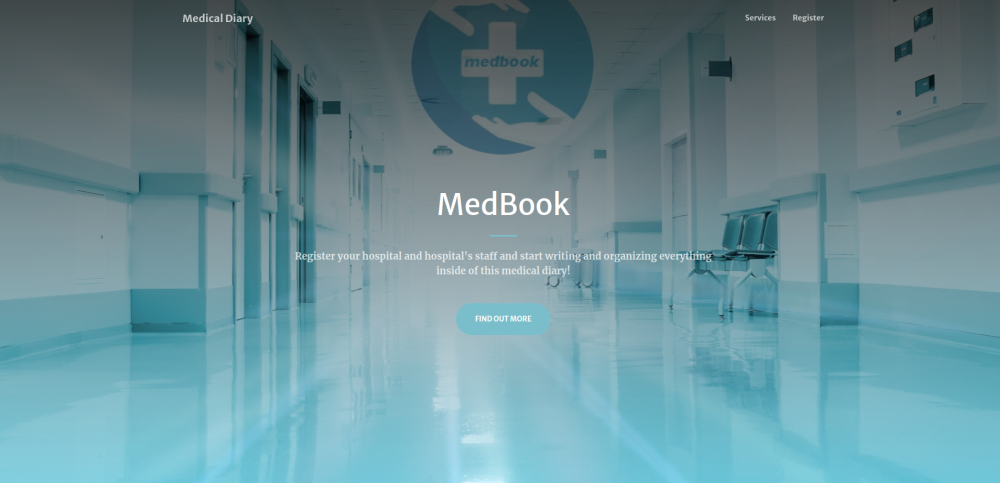


## admin (superuser) details: 
username: nikola
password: 123456789

For simplicity, password for any user I've created is: _R7$QmTS\:eN3t;k


## Registering staff members:

So far, the staff roles are divided into 3 categories: receptionist, nurse and doctor. The staff can be added into the database only through the admin panel (beucase it doesn't make sence for someone to be able to sign up as a doctor :stuck_out_tongue_winking_eye: )

First the staff member needs to (1) register throught the register page. This automatically adds them to the Patient group of the Users. So, (2) in the admin panel, this has to be changed.

### (1) - registering

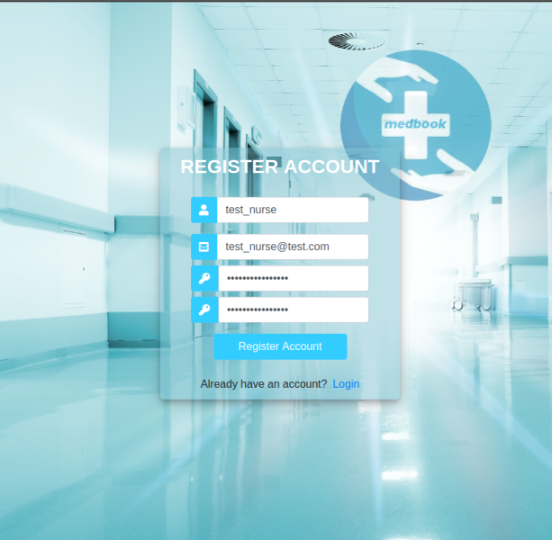

### (2) - admin panel changes

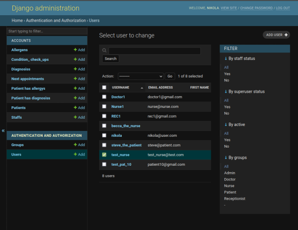


Then, in the staff table, the nurse has to be registered as well. 

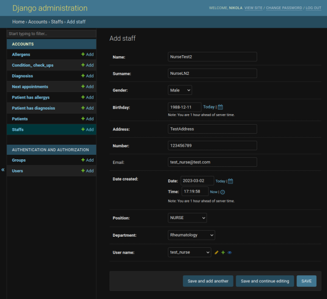

With that, we have a functioning nurse profile. The concept is simillar for creating doctor and receptionist profiles.

## Patient registration:
Patients need to register on the same page and they immediately entered into the Patient category. 

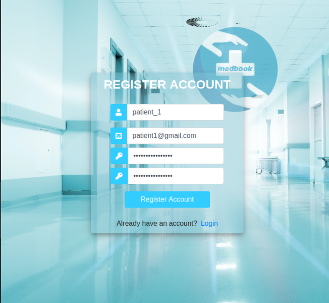

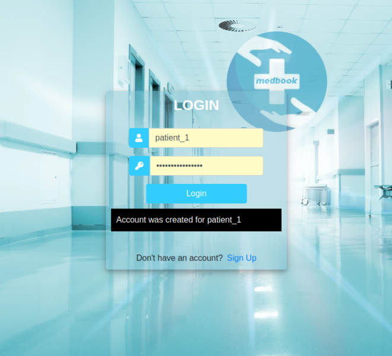

If they log in and their account is not connected to a patient account in the database, they're promted to this.


Then it's the receptionist job to connect them to an account. (See roles --> Receptionist)

With this, the patient can see their medical history and print it (without the header and footer).

[INSERT IMAGE]

## Roles:

All 3 roles have the same dashboard but they can edit different forms.

### Receptionist:
A receptionist can add patients into the database and can create an appointment for patients - doctors/nurses.

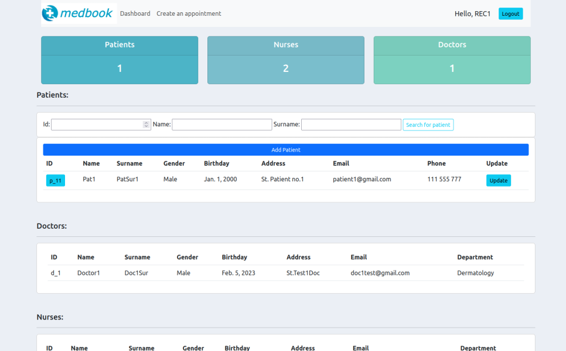

When creating a patient (or updating a patient) they can eigther leave the 'User' field blank - if the patient has not registered on the website yet, or they can select the username of the patient so that the patient can access their details.


On click of the the patient id button on the dahboard, the receptionist can see more information about the patient.


Here they can edit the patient details and the next appointment, but they can't add diagnosis, alergies and checkups.

### Nurse:

The nurse is not able to add patients to the database.


They can add alergies and checkups of the patient (and of course modify them).

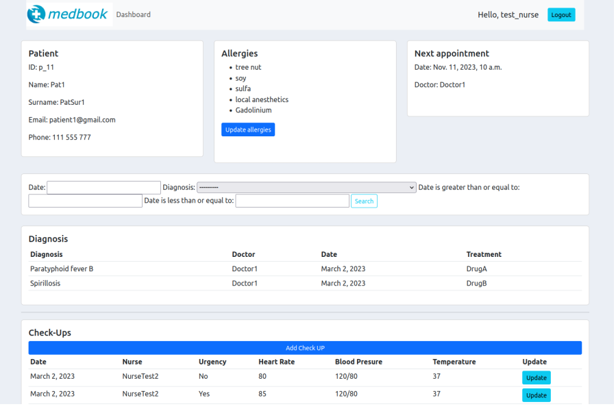

Allergy:


Check-up:


### Doctor:

The doctor's dashboard is the same as the nurse's as they can't add patients in the database.

A doctor can add a diagnosis, allergies and a check-up date.

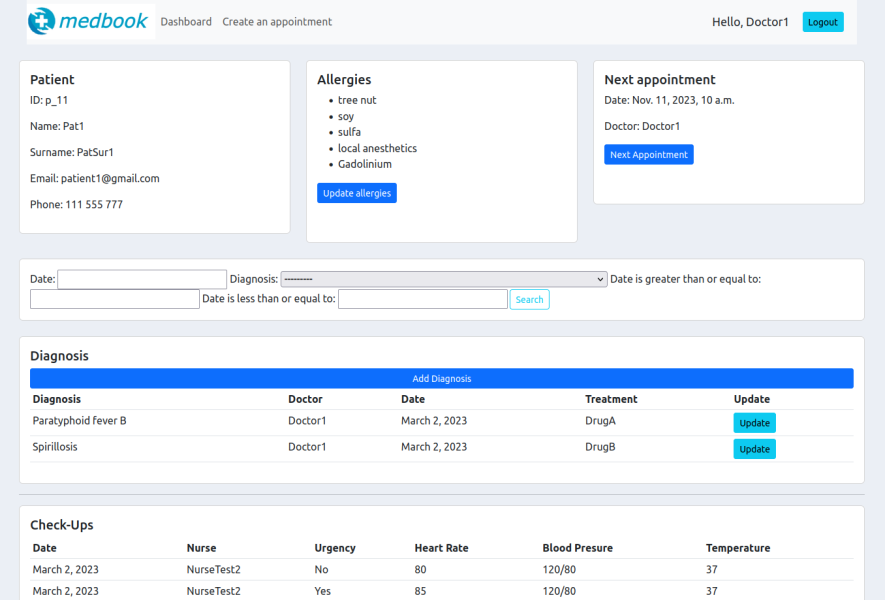

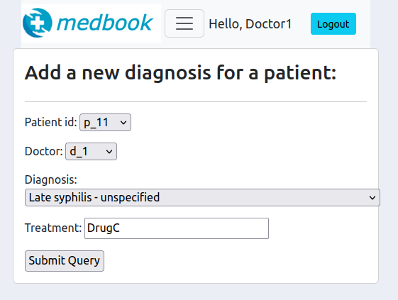

## Patient log-in:

On their profile, the patient can see their next appointment, diagonsis and check-ups.


They can print all this information:

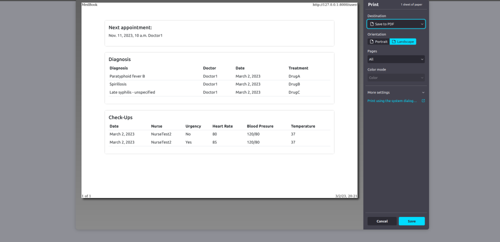

In the print, the header and the print button are not included, so it resembles a legitamate document.

## Trying to access url they do not have permissions to:

If any user (patient, doctor, nurse, receptionist) tries to access views they don't have permissions to, they're promted to a page: 


# Runserver:

* install the 'requirements.txt'.
* cd to the 'website' folder
* run the code: 
```
python manage.py runserver
```
